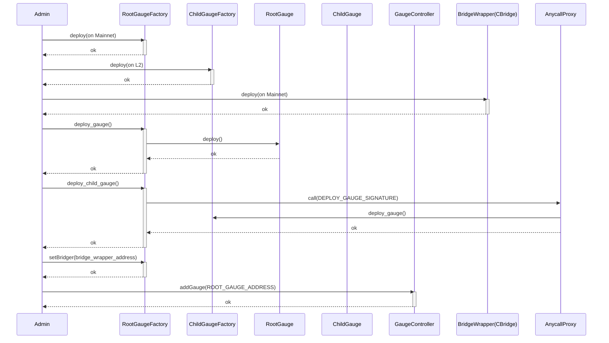

```mermaid
sequenceDiagram
	participant a as Admin
	participant rgf as RootGaugeFactory
	participant cgf as ChildGaugeFactory
	participant rg as RootGauge
	participant cg as ChildGauge
	participant gc as GaugeController
	participant bw as BridgeWrapper(CBridge)
	participant acp as AnycallProxy

	a ->> rgf: deploy(on Mainnet)
	activate rgf
	rgf -->> a: ok
	deactivate rgf

	a ->> cgf: deploy(on L2)
	activate cgf
	cgf -->> a: ok
	deactivate cgf

	a ->> bw: deploy(on Mainnet)
	activate bw
	bw -->> a: ok
	deactivate bw

	a ->> rgf: deploy_gauge()
	activate rgf
	rgf ->> rg: deploy()
	rg -->> rgf: ok
	rgf -->> a: ok
	deactivate rgf

	a ->> rgf: deploy_child_gauge()
	activate rgf
	rgf ->> acp: call(DEPLOY_GAUGE_SIGNATURE)
	acp ->> cgf: deploy_gauge()
	acp -->> rgf: ok
	rgf -->> a: ok
	deactivate rgf

	a ->> rgf: setBridger(bridge_wrapper_address)
	activate rgf
	rgf -->> a: ok
	deactivate rgf

	a ->> gc: addGauge(ROOT_GAUGE_ADDRESS)
	activate gc
	gc -->> a: ok
	deactivate gc

```
