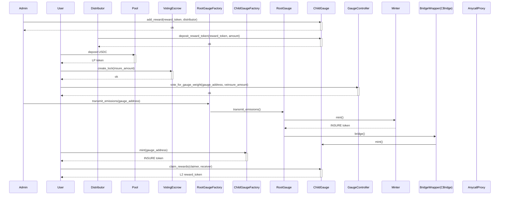

```mermaid
sequenceDiagram
	participant a as Admin
	participant u as User
	participant d as Distributor
	participant p as Pool
	participant ve as VotingEscrow
	participant rgf as RootGaugeFactory
	participant cgf as ChildGaugeFactory
	participant rg as RootGauge
	participant cg as ChildGauge
	participant gc as GaugeController
	participant m as Minter
	participant bw as BridgeWrapper(CBridge)
	participant acp as AnycallProxy


	a ->> cg: add_reward(reward_token, distributor)
	activate cg
	cg -->> a: ok
	deactivate cg

	d ->> cg: deposit_reward_token(reward_token, amount)
	activate cg
	cg -->> d: ok
	deactivate cg

	u ->> p: deposit USDC
	activate p
	p -->> u: LP token
	deactivate p

	u ->> ve: create_lock(insure_amount)
	activate ve
	ve -->> u: ok
	deactivate ve

	u ->> gc: vote_for_gauge_weight(gauge_address, veinsure_amount)
	activate gc
	gc -->> u: ok
	deactivate gc

	a ->> rgf: transmit_emissions(gauge_address)
	activate rgf
	rgf ->> rg: transmit_emissions()
	rg ->> m: mint()
	m -->> rg: INSURE token

	rg ->> bw: bridge()
	bw ->> cg: mint()

	u ->> cgf: mint(gauge_address)
	activate cgf
	cgf -->> u: INSURE token
	deactivate cgf

	u ->> cg: claim_rewards(claimer, receiver)
	activate cg
	cg -->> u: L2 reward_token
	deactivate cg
```
